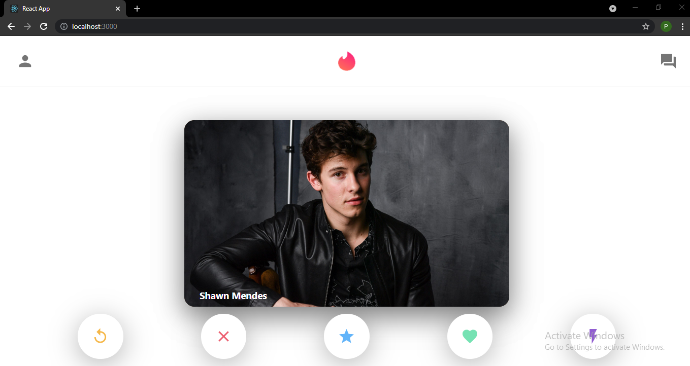

# Tinder Clone using MERN Stack

Tinder UI Clone built using the MERN Stack (MongoDB, Express, React and Node)

## How it works

- The data (image urls and names) is stored in MongoDB.
- When you open the web app, the images and names from the database is pulled through and displayed on the Tinder card.
- The Tinder cards are created by using react-tinder-card.
  
## Frontend

- React
- CSS
- Flexbox
- Material UI Icons

  
## Backend

- node.js
- express.js
- mongooseJs
- axios
- cors
- react-tinder-card
  
## Database

- MongoDB

## Screenshot

